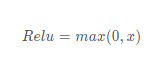
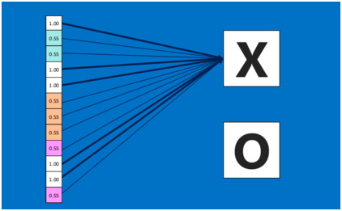
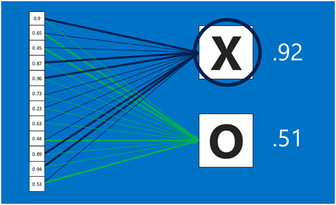
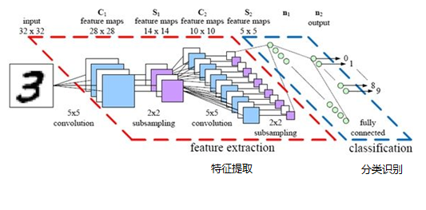

# 深度学习

# TensorFlow

## 介绍

TensorFlow™ 是一个采用数据流图（data flow graphs），用于数值计算的开源软件库。节点（Nodes）在图中表示数学操作，图中的线（edges）则表示在节点间相互联系的多维数据数组，即张量（tensor）。它灵活的架构让你可以在多种平台上展开计算，例如台式计算机中的一个或多个CPU（或GPU），服务器，移动设备等等。

数据流图用“结点”（nodes）和“线”(edges)的有向图来描述数学计算。“节点” 一般用来表示施加的数学操作，但也可以表示数据输入（feed in）的起点/输出（push out）的终点，或者是读取/写入持久变量（persistent variable）的终点。“线”表示“节点”之间的输入/输出关系。这些数据“线”可以输运“size可动态调整”的多维数据数组，即“张量”（tensor）。张量从图中流过的直观图像是这个工具取名为“Tensorflow”的原因。一旦输入端的所有张量准备好，节点将被分配到各种计算设备完成异步并行地执行运算。

用张量表示数据，用计算图搭建神经网络，用会话执行计算图，优化线上的权重（参数），得到模型。

http://playground.tensorflow.org/

### TensorFlow计算模型——计算图

计算图——搭建神经网络的计算过程，只搭建，不运算。

TensorFlow 的名字中己经说明了它最重要的两个概念一一Tensor 和Flow 。Tensor 就是张量。张量这个概念在数学或者物理学中可以有不同的解释。在TensorFlow 中，张量可以被简单地理解为多维数组，如果说TensorFlow 的第一个词Tensor 表明了它的数据结构，那么Flow 则体现了它的计算模型。Flow 翻译成中文就是“流”，它直观地表达了张量之间通过计算相互转化的过程。

TensorFlow 是一个通过计算图的形式来表述计算的编程系统。TensorFlow中的每一个计算都是计算图上的一个节点，而节点之间的边描述了计算之间的依赖关系。


TensorFlow 程序一般可以分为两个阶段。

在第一个阶段需要定义计算图中所有的计算。
比如在上图向量加法样例程序中首先定义了两个输入，然后定义了一个计算来得到它们的和。

第二个阶段为执行计算。

```python
import tensorflow as tf
a = tf.constant([1.0, 2.0], name='a')
b = tf.constant([2.0, 3.0], name='b')
result = a + b
```

### **TensorFlow数据模型——张量（tf.Tensor）**

https://tensorflow.google.cn/guide/tensors

张量——多维数组（列表），阶——张量的维数。

在TensorFlow程序中，所有的数据都通过张量的形式来表示。从功能的角度上看，张量可以被简单理解为**多维数组**。其中零阶张量表示标量（ scalar ） ，也就是一个数 ； 第一阶张量为向量（ vector),也就是一个一维数组；第n 阶张量可以理解为一个n 维数组。

| 阶   | 数学实例           |                             |
| ---- | ------------------ | --------------------------- |
| 0    | 标量（只有大小）   | s=123                       |
| 1    | 矢量（大小和方向） | v=[1,2,3]                   |
| 2    | 矩阵（数据表）     | m=[[1,2,3],[4,5,6],[7,8,9]] |
| n    | n 阶张量           | t=[[[[...]]]]      n个[]    |

但张量在Tensor Flow 中的实现并不是直接采用数组的形式，它只是对TensorFlow 中运算结果的引用。在张量中并没有真正保存数字，它保存的是如何得到这些数字的计算过程。还是以向量加法为例，当运行如下代码时，并不会得到加法的结果，而会得到对结果的一个引用。

```python
import tensorflow as tf
# tf.constant 是一个计算，这个计算的结果为一个张量， 保存在变量a 中。
a = tf.constant([1.0,2.0],name ='a')
b = tf.constant([2.0,3.0], name ='b')
result = tf.add(a,b, name='add')
print(result)
'''
输出：
Tensor("add:0", shape=(2,), dtype=float32)
'''
```

从上面代码的运行结果可以看出， 一个张量中主要保存了三个属性： 

**名字（ name ）、维度（ shape ）和类型（ type ）**。

我们从上图了解了Tensor Flow 的计算都可以通过计算图的模型来建立，
而计算图上的每一个节点代表了一个计算，计算的结果就保存在张量之中。所以张量和计算图上节点所代表的计算结果是对应的。这样张量的命名就可以通过“ **node:src_ output** ”的形式来给出。其中node 为节点的名称， src一output 表示当前张量来自节点的第几个输出。
比如上面代码打出来的 "add:0" 就说明了result 这个张量是计算节点“ add ” 输出的第一个结果（编号从0开始）。

张量的第二个属性是张量的维度（ shape ）。这个属性描述了一个张量的维度信息。比如上面样例中 shape = ( 2,  ) 说明了张量result 是一个一维数组， 这个数组的长度为2 。

张量的第三个属性是类型（ type ），每一个张量会有一个唯一的类型。TensorFlow 会对参与运算的所有张量进行类型的检查， 当发现类型不匹配时会报错。

TensorFlow 支持14 种不同的类型， 主要包括了实数（ tf.float32 、tf.float64 ）、整数（ tf.int8 、tf.intl6 、tf.int32 、tf.int64 、tf.uint8 ）、布尔型（ tf.bool) 和复数（ tf.complex64 、tf.complex128 ） 。


### TensorFlow运行模型——会话（session）

执行计算图中的节点运算。

前面的两节介绍了TensorFlow 是如何组织数据和运算的。本节将介绍如何使用
TensorFlow 中的会话（ session ）来执行定义好的运算。会话拥有并管理TensorFlow 程序运行时的所有资源。所有计算完成之后需要关闭会话来帮助系统回收资源，否则就可能出现资源泄漏的问题。TensorFlow 中使用会话的模式一般有两种，第一种模式需要明确调用会话生成函数和关闭会话函数，这种模式的代码流程如下。

```python
# 创建一个会话。
sess = tf.Session()

#使用这个创建好的会话来得到关心的运算的结果。比如可以调用sess.run(result),
# 来得到上述例中张量result 的取值。
print(sess.run(result))

# 关闭会话使得本次运行中使用到的资源可以被释放。
sess.close()
```

使用这种模式时，在所有计算完成之后，需要明确调用Session.close 函数来关闭会话并释放资源。

为了解决异常退出时资源释放的问题， TensorFlow 可以通过Python 的上下文管理器来使用会话。以下代码展示了如何使用这种模式。

```python
#创建一个会话，并通过Python 中的上下文管理器来管理这个会话。
with tf.Session() as sess:
#使用创建好的会话来计算关心的结果。
  print(sess.run(result))
#不需要再调用" Session.close()"函数来关闭会话，
#当上下文退出时会话关闭和资源释放也自动完成了。
```

通过Python 上下文管理器的机制，只要将所有的计算放在“ with ”的内部就可以。当上下文管理器退出时候会自动释放所有资源。这样既解决了因为异常退出时资源释放的问题，同时也解决了忘记调用Session.close 函数而产生的资源泄漏。

### 变量（ tf. Variable ）

变量（ tf. Variable ）的作用就是保存和更新神经网络中的参数。

参数：即线上的权重W，用变量表示，随机给初值。

当创建一个变量时，你将一个张量作为初始值传入构造函数Variable()。TensorFlow提供了一系列操作符来初始化张量，初始值是常量或是随机值。

注意，所有这些操作符都需要你指定张量的shape。那个形状自动成为变量的shape。变量的shape通常是固定的，但TensorFlow提供了高级的机制来重新调整其行列数。

```python
# 生成200个全0元素的张量
biases = tf.Variable(tf.zeros([200]), name="biases")

#正态分布，产生784*200的矩阵，标准差为0.35，均值为0.随机种子
weights = tf.Variable(tf.random_normal([784, 200], stddev=0.35,mean=0, seed=1),name="weights")
```

神经网络中常用的生成随机数数组的函数有：

| 函数                  | 描述                               |
| --------------------- | ---------------------------------- |
| tf.random_normal()    | 生成正态分布随机数                 |
| tf.truncated_normal() | 生成去掉过大偏离点的正态分布随机数 |
| tf.random_uniform()   | 生成均匀分布随机数                 |
| tf.zeros              | 表示生成全 0 数组                  |
| tf.ones               | 表示生成全 1 数组                  |
| tf.fill               | 表示生成全定值数组                 |
| tf.constant           |                                    |

变量的初始化必须在模型的其它操作运行之前先明确地完成。最简单的方法就是添加一个给所有变量初始化的操作，并在使用模型之前首先运行那个操作。

```python
# Create two variables.
weights = tf.Variable(tf.random_normal([784, 200], stddev=0.35),name="weights")
biases = tf.Variable(tf.zeros([200]), name="biases")
...
# Add an op to initialize the variables.
init_op = tf.initialize_all_variables()

# Later, when launching the model
with tf.Session() as sess:
  # Run the init operation.
  sess.run(init_op)
  ...
  # Use the model
  ...
```

## 神经网络的实现过程

1、准备数据集，提取特征，作为输入喂给神经网络（ Neural Network NN)
2、搭建 NN 结构，从输入到输出（先搭建计算图，再用会话执行）
3、大量特征数据喂给 NN ，迭代优化 NN 参数
4、使用训练好的模型预测和分类

### 基于tensorflow的前向传播

变量初始化：在 sess.run 函数中用 tf.global_variables_initializer() 汇总所有待优化变量。

```python
init_op = tf.global_variables_initializer()
sess.run(init_op)
```

计算图节点运算：在sess.run函数中写入待运算的节点

```python
sess.run(y)
```

用 tf.placeholder占位，在 sess.run 函数中用函数中用 feed_dict喂数据

```python
with tf.Session() as sess:
	#喂一组数据：
	x = tf.placeholder(tf.float32, shape=(1, 2))
	y = x + x
	r = sess.run(y, feed_dict={x: [[0.5,0.6]]})
	print(r)
	#喂多组数据：
	x = tf.placeholder(tf.float32, shape=(None, 2))
	y = tf.reduce_sum(x, 0)
	r = sess.run(y, feed_dict={x: [[0.1,0.2],[0.2,0.3],[0.3,0.4],[0.4,0.5]]})
	print(r)
```

## 反向传播

反向传播 ：训练模型参数 ，在所有参数上用梯度下降，使神经网络模型在训练数据上的损失函数最小。

### 损失函数

损失函数的计算有很多方法。

#### 解决回归问题的损失函数：均方误差MSE


用tensorflow 函数表示为loss_mse = tf.reduce_mean(tf.square(y_ - y))

反向传播训练方法： 以减小 loss 值为优化目标 ，有梯度下降 、  adam优化器等优化方法。

这两种优化方法用tensorflow 的函数可以表示为：

```python
train_step=tf.train.GradientDescentOptimizer(learning_rate).minimize(loss)

train_step=tf.train.AdamOptimizer(learning_rate).minimize(loss)
```


1. tf.train.GradientDescentOptimizer 使用随机梯度下降算法，使参数沿着
   梯度的反方向，即总损失减小的方向移动，实现更新参数。

   其中，𝐽(𝜃)为损失函数， 𝜃为参数， 𝛼为学习率。

   

2. tf.train.AdamOptimizer() 是利用自适应学习率的优化算法， Adam 算法和随机梯度下降算法不同。随机梯度下降算法保持单一的学习率更新所有的参数，学习率在训练过程中并不会改变。而 Adam 算法通过计算梯度的一阶矩估计和二阶矩估计而为不同的参数设计独立的自适应性学习率。

学习率 learning_rate： 决定每次参数更新的幅度。
优化器中都需要一个叫做学习率的参数，使用时如果学习率选择过大会导致待优化的参数在最小值附近波动不收敛的情况，如果学习率选择过小，会出现收敛速度慢的情况。 我们可以选个比较小的值填入， 比如 0.01 、 0.001。

#### 解决分类问题的损失函数：交叉熵（ cross entropy ）

假设有两个分布p（1, 0, 0）与 q（0.8, 0.1, 0.1），则它们在给定样本集上的交叉熵定义如下： 
$$
CE(p,q)=−\sum_{}p(x)logq(x)
$$

------

用Tensorflow 函数表示

```python
ce=-tf.reduce_sum(p * tf.log(tf.clip_by_value(q, 1e-12, 1.0))) 
```

（1e-12 是为了防止log0出现）

两个神经网络模型解决二分类问题中，已知标准答案为p = (1, 0)，第一个神经网络模型预测结果为q1=(0.6, 0.4)，第二个神经网络模型预测结果为q2=(0.8, 0.2)，判断哪个神经网络模型预测的结果更接近标准答案。
根据交叉熵的计算公式得：

```
H1((1,0),(0.6,0.4)) = -(1*log0.6 + 0*log0.4) ≈≈ -(-0.222 + 0) = 0.222
H2((1,0),(0.8,0.2)) = -(1*log0.8 + 0*log0.2) ≈≈ -(-0.097 + 0) = 0.097
```

由于0.222>0.097，所以预测结果y2与标准答案与标准答案y_更接近，y2预测更准确。

**总结：**

交叉熵刻画了两个概率分布之间的距离， 它是分类问题中使用比较广的一种损失函数。

交叉熵越大，两个概率分布距离越远， 两个概率分布越相异 ;

交叉熵越小，两个概率分布距离越近 ，两个概率分布越相似 。


TensorFlow针对分类问题，实现了常见的交叉熵函数，分别是

- **tf.nn.sigmoid_cross_entropy_with_logits**

```python
tf.nn.sigmoid_cross_entropy_with_logits(logits=预测输出, labels=真实输出)
```

计算方式：对输入的y'先通过sigmoid函数计算，再计算它们的交叉熵，但是它对交叉熵的计算方式进行了优化，使得出的结果不至于溢出。

适用：每个类别相互独立但互不排斥的情况：例如一幅图可以同时包含一条狗和一只大象。

output不是一个数，而是一个batch中每个样本的loss,所以一般配合`tf.reduce_mean(loss)`使用。

```python
import tensorflow as tf
import numpy as np

# 5个样本三分类问题，且一个样本可以同时拥有多类
y = np.array([[1,0,0],[1,0,0]], dtype='f8')
y_ = np.array([[12,3,2],[3,10,1]], dtype='f8')
sess =tf.Session()
error = sess.run(tf.nn.sigmoid_cross_entropy_with_logits(labels=y, logits=y_))
print(error) 
print(error.mean(axis=1)) 
sess.close()
```

- **tf.nn.softmax_cross_entropy_with_logits**

```python
tf.nn.softmax_cross_entropy_with_logits(labels=None, logits=None)
```

计算方式：对输入的logits先通过softmax函数计算，再计算它们的交叉熵，但是它对交叉熵的计算方式进行了优化，使得结果不至于溢出。

适用：每个类别相互独立且排斥的情况，一幅图只能属于一类，而不能同时包含一条狗和一只大象。

output：不是一个数，而是一个batch中每个样本的loss，所以一般配合`tf.reduce_mean(loss)`使用。

```python
import tensorflow as tf
import numpy as np

y = np.array([[1,0,0],[1,0,0]], dtype='f8')# 每一行只有一个1
y_ =np.array([[12,3,2],[3,10,1]], dtype='f8')
sess = tf.Session()
error = sess.run(tf.nn.softmax_cross_entropy_with_logits(labels=y,logits=y_))
print(error)
```


## 神经网络计算过程：

1. 导入模块，生成模拟数据集；
   import
   常量定义
   生成数据集

2. 前向传播：定义输入、参数和输出
   x =              y =
   w1 =           w2 =
   b1 =            b2 = 

   y_ = 
   
3. 反向传播：定义损失函数、反向传播方法
   loss = 
   train_step = 

4. 生成会话，训练 STEPS 轮

   ```python
   with tf.session() as sess:
       init_op=tf.global_variables_initializer()
       sess.run(init_op)
       STEPS=3000
       for i in range(STEPS):
           start=
           end=
           sess.run(train_step, feed_dict:)
   ```

### 基于tensorflow训练神经网络

```python
#coding utf-8
#导入模块，生成模拟数据集
import tensorflow as tf
import numpy as np
import sklearn.datasets as datasets
import matplotlib.pyplot as mp
BATCH_SIZE = 8
seed =23455

np.random.seed(0)
X, Y = datasets.make_moons(200, noise=0.10)
Y = np.array(np.column_stack((Y, ~Y+2)), dtype='f4')
print(Y)

#定义神经网络的输入、参数和输出，定义向前传播过程
x = tf.placeholder(tf.float32, shape=(None,2), name='x')
y = tf.placeholder(tf.float32, shape=(None,2), name='y')

w1 = tf.Variable(tf.random_normal((2,3),stddev=1,seed=1))
b1 = tf.Variable(tf.random_normal((3,),stddev=1,seed=1))
w2 = tf.Variable(tf.random_normal((3,2),stddev=1,seed=1))
b2 = tf.Variable(tf.random_normal((2,),stddev=1,seed=1))

l1 = tf.nn.sigmoid(tf.add(tf.matmul(x,w1), b1))
y_ = tf.add(tf.matmul(l1,w2), b2)

#定义损失函数及反向传播方法
loss = tf.reduce_sum(tf.nn.softmax_cross_entropy_with_logits(labels=y,logits=y_)) 
train_step = tf.train.GradientDescentOptimizer(0.01).minimize(loss)
#train_step=tf.train.AdamOptimizer(0.001).minimize(loss)

#生成会话，训练STEPS轮
with tf.Session() as sess:
    init_op=tf.global_variables_initializer()
    sess.run(init_op)

    #训练模型
    STEPS = 30000
    for i in range(STEPS):
        start = (i*BATCH_SIZE) % 32
        end = start + BATCH_SIZE
        sess.run(train_step,feed_dict={x:X[start:end], y:Y[start:end]})
        if i % 500 ==0:
            total_loss = sess.run(loss,feed_dict={x:X, y:Y})
            print("After %d training steps, loss on all data is %g"%(i,total_loss))

    pred_y = sess.run(y_, feed_dict={x:X})
    pred_y = np.piecewise(pred_y, [pred_y<0, pred_y>0], [0, 1])

    l, r = X[:, 0].min() - 1, X[:, 0].max() + 1
    b, t = X[:, 1].min() - 1, X[:, 1].max() + 1
    n = 500
    grid_x, grid_y = np.meshgrid(np.linspace(l, r, n), np.linspace(b, t, n))
    samples = np.column_stack((grid_x.ravel(), grid_y.ravel()))

    grid_z = sess.run(y_, feed_dict={x:samples})
    grid_z = grid_z.reshape(-1, 2)[:,0]
    grid_z = np.piecewise(grid_z, [grid_z<0, grid_z>0], [0, 1])
    grid_z = grid_z.reshape(grid_x.shape)
    mp.figure('Logistic Classification', facecolor='lightgray')
    mp.title('Logistic Classification', fontsize=20)
    mp.xlabel('x', fontsize=14)
    mp.ylabel('y', fontsize=14)
    mp.tick_params(labelsize=10)
    mp.pcolormesh(grid_x, grid_y, grid_z, cmap='gray')
    mp.scatter(X[:, 0], X[:, 1], c=Y[:,0], cmap='brg', s=80)
    mp.show()
```

由神经网络的实现结果，我们可以看出，总共 训练 30000 轮。 每轮从 X 的数据集和 Y 的标签中抽取相对应的从 start 开始到 end 结束个特征值 和 标签 喂入神经网络。 用 sess.run 求出 loss， 每 500 轮打印一次 loss 值 。经过 3000 轮后 我们打印出 最终训练好的 参数 w1 、 w2 。

## 图像处理与CNN

### 计算机眼中的图像

在计算机中，对于图像存储是通过矩阵来存储的。照片分为黑白和彩色。在图像里我们相应的有灰度图和彩色图。

对于灰度图像，由于只有明暗的区别，因此只需要一个数字就可以表示出不同的灰度。通常用0表示最暗的黑色，255表示最亮的白色，介于0和255之间的整数则表示不同明暗程度的灰色。

对于彩色图像，我们用（R,G,B）三个数字来表示一个颜色，他们表示用红（R）、绿（G）、蓝（B）三种基本颜色叠加后的颜色。对于每种基本颜色，我们用0到255之间的整数表示这个颜色分量的明暗程度。


三个数字中对应的某种基本颜色的数字越大，表示该基本颜色的比例越大，例如（255,0,0）表示纯红色，（0,255,0）表示纯绿色，（135,206,255）表示天蓝色。

一张彩色图片我们可以用一个由整数组成的立方体阵列来表示。我们称这样的立方体排列的数字阵列为三阶张量（tensor）。这个三阶张量的长度与宽度就是图片的分辨率，高度为3.对于数字图像而言，三阶张量的高度也成为通道（channel）数，因此我们说彩色图像有3个通道。矩阵可以看成是高度为1的三阶张量。

 

### 图像特征概述

在深度学习出现之前，图像特征的设计一直是计算机视觉领域中一个重要的研究课题，在这个领域发展初期，人们手工设计了各种图像特征，这些特征可以描述图像的颜色、边缘、纹理等性质，结合机器学习技术，能解决物体识别和物体检测等实际问题。

既然图像在计算机中可以表示成三阶张量，那么从图像中提取特征便是对这个三阶张量进行运算的过程。其中非常重要的一种运算就是卷积。

### 卷积运算

#### 卷积定义

卷积是两个变量在某范围内相乘后求和的结果。

#### 一维卷积

卷积运算的物理意义：一个函数（如：单位响应）在另一个函数（如:输入信号）上的加权叠加

有两个离散信号

待卷积信号 X=[1,2,3,0,1,0]，

卷积核 H=[1,2,1]

卷积运算 Y = X * H

​         

**valid**

自始至终卷积核都在“信号内”

最后得到的结果的长度会小于卷积信号的长度

 

**same**

卷积核的中心刚好是从待卷积信号的第一个元素“划”到最后一个元素卷积结果的长度和待卷积信号长度一样

 

**full** 

从卷积核的最后一个元素开始，直到第一个元素到与待卷积信号第一个元素对齐卷积结果的长度是n+m-1 

#### 二维卷积

图像数据是5x5的二维矩阵，使用一个3x3的卷积核，从左到右从上到下滑动。滑动的过程称为stride，一个卷积层有两个stride，分别从上到下，从左到右，步长一般设定为1或2。

 

#### 利用卷积提取图像特征

卷积运算在图像处理中应用十分广泛，许多图像特征提取方法都会用到卷积。以灰度图为例，，我们知道在计算机中，一个灰度图像被表示为一个整数矩阵，如果我们用一个形状较小的矩阵和这个图像矩阵做卷积运算，就可以得到一个新的矩阵，这个新的矩阵可以看作是一副新的图像，换句话说，通过卷积运算，我们可以将原图像变换为一副新的图像。这幅新图像比原图像更清楚地表示了某些性质，我们就可以把它看做原图像的一个特征。

这里用到的小矩阵就称为卷积核（convolution lernel），通常，图像矩阵中的元素都是介于0到255的整数，但卷积核中的元素可以是任意实数。

通过卷积，我们可以从图像中提取边缘特征，在没有边缘的比较平坦的区域，图像的像素值的变化较小，而横向边缘上下两侧的像素值 差异明显，竖向边缘左右两侧的像素也会有较大差别。


如上图，我们用1、0、-1 组成的卷积核与原图像进行卷积运算，可以从图像中提取出竖向边缘。


如上图，我们用三行1,0，-1组成的卷积核，从图中提取出了横向边缘。

事实上，这两个卷积核分别计算了原图像上每个3*3区域内左右像素或者上下像素的差值（为了将运算结果以图像的形式显示出来，我们对运算结果去了绝对值），通过这样的运算，我们就可以从图像上提取不同的边缘特征。

### 卷积神经网络CNN基本结构

Alex Net 神经网络


上图为Alex Net 神经网络的主体部分，主体部分有5个卷积层和3个全连接层组成

5个卷积层位于网络的最前端，依次**对图像进行变换以提取特征**；

每个卷积层之后都有一个**ReLU**非线性激活层**完成非线性变换；**

第一、二、五个卷积层之后连接有最大池化 层，用以**降低特征图的分辨率**。

经过5个卷积层以及相连的非线性激活层与池化层之后，特征图被转换为4096维特征向量，在经过两次全连接层和ReLU层变换之后，成为最终的特征向量，在经过一个全连接层和一个softmax归一化指数层之后，就得到了对图片所属类型的预测。

#### 卷积层

神经网络中的卷积层就是用卷积运算对原始图像或者上一层的特征进行变换的层。在前边的学习中，我们学习了边缘特征的提取，知道一种特定的卷积核可以对图像进行一种特定的变换，从而提取出某种特定的特征，如横向边缘或者竖向边缘。

在一个卷积层中，为了从图像中提取多种形式的特征，我们通常使用多个卷积核对输入的图像进行不同的卷积操作。一个卷积核可以得到一个通道为1的三阶张量，，多个卷积核就可以得到多个通道为1的三阶张量结果。我们把这些结果作为不同的通道组合起来，就可以得到一个新的三阶张量，这个三阶张量的通道数就等于我们使用的卷积核的个数。由于每一个通道都是从原图像中提取的一种特征，我们也将这个三阶张量称为特征图（feature map）。这个特征图就是卷积层的最终输出。

特征图与彩色图像都是三阶张量，也都有若干个通道。因此卷积层不仅可以作用于图像，也可以作用于其他输出的特征图。通常，一个深度神经网络的第一个卷积层会以图像作为输入，而之后的卷积层会以前面的特征图为输入。

#### 非线性激活层

通常我们需要在每个卷积层和全连接层后面都连接一个非线性激活层（non-linear activation layer）。为什么呢？其实不管是卷积运算还是全连接层中的运算，他们都是自变量的一次函数，即所谓的线性函数（linear function）。线性函数有一个性质：若干线性计算的复合仍然是线性的。换句话说，如果我们只是将卷积层和全连接层直接堆叠起来，，那么它们对输入图片产生的效果就可以被一个全连接层替代。这样一来，虽然我们堆叠了很多层，但对每一层的变换效果实际上被合并到了一起。而如果我们在每次线性运算后，再进行一次非线性运算，那么每次变换的效果就可以保留。非线性激活层的形式与很多种，它们的基本形式是先选定某种非线性函数，然后对输入特征图或者特征向量的每一个元素应用这种非线性函数，得到输出。

常见的非线性函数有：

l  逻辑函数（logistic function）sigmoid


l  双曲正切函数（hyperbolic tangent function）


l  修正线性函数（rectified linear function）




前两者sigmoid/tanh比较常见于全连接层，后者ReLU常见于卷积层。

激活函数是用来加入非线性因素的，使得神经网络可以任意逼近任何非线性函数，提高神经网络对模型的表达能力，解决线性模型所不能解决的问题，这样神经网络就可以应用到众多的非线性模型中。

以ReLU层为例，对于输入的特征向量或特征图，他会将其中小于零的元素变成零，而其他元素的值保持不变，就得到了输出。


因为ReLU的计算非常简单，所以它的计算速度往往比其他非线性激活层快很多，加之其在实际应用中的效果也很好，因此在深度神经网络中被广泛地使用。

####  池化层

在计算卷积时，我们会用卷积核滑过图像或者特征图的每一个像素。如果图像或者特征图的分辨率很多，那么卷积的计算量就会很大。为了解决 这个问题，我们通常在几个卷积层之后插入池化层（pooling layer），已降低特征图的分辨率。

池化层的基本操作步骤如下。首先，我们将特征图按通道分开，得到若干个矩阵。对于每个矩阵，我们将其切割成若干大小相等的正方形小块。如下图，我们将一个4x4的矩阵分割成4个正方形区块，每个区块的大小为2x2接下来，我们对每一个区块取最大值或者平均值，并将结果组成一个新的矩阵。最后，我们将所有通道的结果矩阵按原顺序堆叠起来形成一个三阶张量，这个三阶张量就是池化层的输出。**对于每一个区块取最大值的池化层，我们称之为最大池化层（max pooling），而取平均值的池化层成为平均池化层（average pooling layer）。**


在经过池化后，特征图的长和宽都会减小到原来的1/2，特征图中的元素数目减小到原来的1/4。通常我们会在卷积层之后增加池化层。这样，在经过若干卷积、池化层的组合之后，在不考虑通道数的情况下，特征图的分辨率就会远小于输入图像的分辨率，大大减小了对计算量和参数数量的需求。

#### 全连接层  FC (full connection)

全连接层在整个卷积神经网络中起到“分类器”的作用，即通过卷积、激活函数、池化等深度网络后，再经过全连接层对结果进行识别分类。：


由于神经网络是属于监督学习，在模型训练时，根据训练样本对模型进行训练，从而得到全连接层的权重（如预测字母X的所有连接的权重)



最后计算出来字母X的识  别值为0.92，字母O的识别值为0.51，则结果判定为X



“卷积神经网络”（CNN）结构，如下图所示：




### 设计卷积神经网络实现手写数字识别

#### mnist 数据集

mnist 数据集 ：包含 7 万张 黑底白字手写数字 图片， 其中 55000 张为训练集，5000 张为验证集， 10000 张 为测试集 。每张图片大小为 28*28 像素，图片中 纯 黑色像素 值为 0， 纯 白色像素值为 1 。数据集的标签是长度为 10 的一维数组，数组中每个元素索引号表示对应数字出现的概率 。

tf.cast(x,dtype) 函数表示将参数 x 转换为指定 数据 类型 。

tf.reduce_mean( x,axis 函数表示求取矩阵或张量指定维度的平均值。 

tf argmax(x,axis) 函数表示 返回 指定维度 a xis 下，参数 x 中 最大值索引号 。

os.path.join 函数表示 把 参数 字符串按照路径命名规则拼接。

字符串 split( 函数表示 按照指定 拆分符 对字符串拆分 返回拆分列表 。

#### 实现

```python
from tensorflow.examples.tutorials.mnist import input_data
import tensorflow as tf
mnist = input_data.read_data_sets('MNIST_data', one_hot=True)

# sample = minist.train.next_batch(1)
# sample[0]  28*28图像    一行784列     输入
# sample[1]  10元素的数组               输出


#生成权重
def weight_variable(shape):
  initial = tf.random_normal(shape, stddev=0.1)
  return tf.Variable(initial)

#生成b
def bias_variable(shape):
  initial = tf.constant(0.1, shape=shape)
  return tf.Variable(initial)

#卷积层
def conv2d(x, W):
  return tf.nn.conv2d(x, W, strides=[1, 1, 1, 1], padding='SAME')

def max_pool_2x2(x):
  return tf.nn.max_pool(x, ksize=[1, 2, 2, 1],
                        strides=[1, 2, 2, 1], padding='SAME')

x = tf.placeholder("float", shape=[None, 784])
y_ = tf.placeholder("float", shape=[None, 10])

# n张 28*28*1的图像
x_image = tf.reshape(x, [-1,28,28,1])

# 32个5*5*1的卷积核   
# 卷积执行过后得到28*28*1*32（32个通道）
W_conv1 = weight_variable([5, 5, 1, 32])
b_conv1 = bias_variable([32])

h_conv1 = tf.nn.relu(conv2d(x_image, W_conv1) + b_conv1)
# 池化过后： 14*14*1*32
h_pool1 = max_pool_2x2(h_conv1)

# (14,14,32) * (5,5,32,64)   => (14*14*64)
W_conv2 = weight_variable([5, 5, 32, 64])
b_conv2 = bias_variable([64])

h_conv2 = tf.nn.relu(conv2d(h_pool1, W_conv2) + b_conv2)
# 池化过后： 7*7*64
h_pool2 = max_pool_2x2(h_conv2)

h_pool2_flat = tf.reshape(h_pool2, [-1, 7*7*64])

W_fc1 = weight_variable([7 * 7 * 64, 1024])
b_fc1 = bias_variable([1024])
h_fc1 = tf.nn.relu(tf.matmul(h_pool2_flat, W_fc1) + b_fc1)
#
# keep_prob = tf.placeholder("float")
# h_fc1_drop = tf.nn.dropout(h_fc1, keep_prob)

# softmax层
W_fc2 = weight_variable([1024, 10])
b_fc2 = bias_variable([10])

y_conv=tf.nn.softmax(tf.matmul(h_fc1, W_fc2) + b_fc2)

with tf.Session() as sess:
    cross_entropy = -tf.reduce_sum(y_*tf.log(y_conv))
    train_step = tf.train.AdamOptimizer(1e-4).minimize(cross_entropy)
    correct_prediction = tf.equal(tf.argmax(y_conv,1), tf.argmax(y_,1))
    accuracy = tf.reduce_mean(tf.cast(correct_prediction, "float"))
    sess.run(tf.initialize_all_variables())
    for i in range(20000):
        batch = mnist.train.next_batch(50)
        if i%100 == 0:
            train_accuracy = accuracy.eval(feed_dict={
                x:batch[0], y_: batch[1]})
            print("step %d, training accuracy %g"%(i, train_accuracy))
        train_step.run(feed_dict={x: batch[0], y_: batch[1]})

    print("test accuracy %g"%accuracy.eval(feed_dict={
        x: mnist.test.images, y_: mnist.test.labels}))
```

